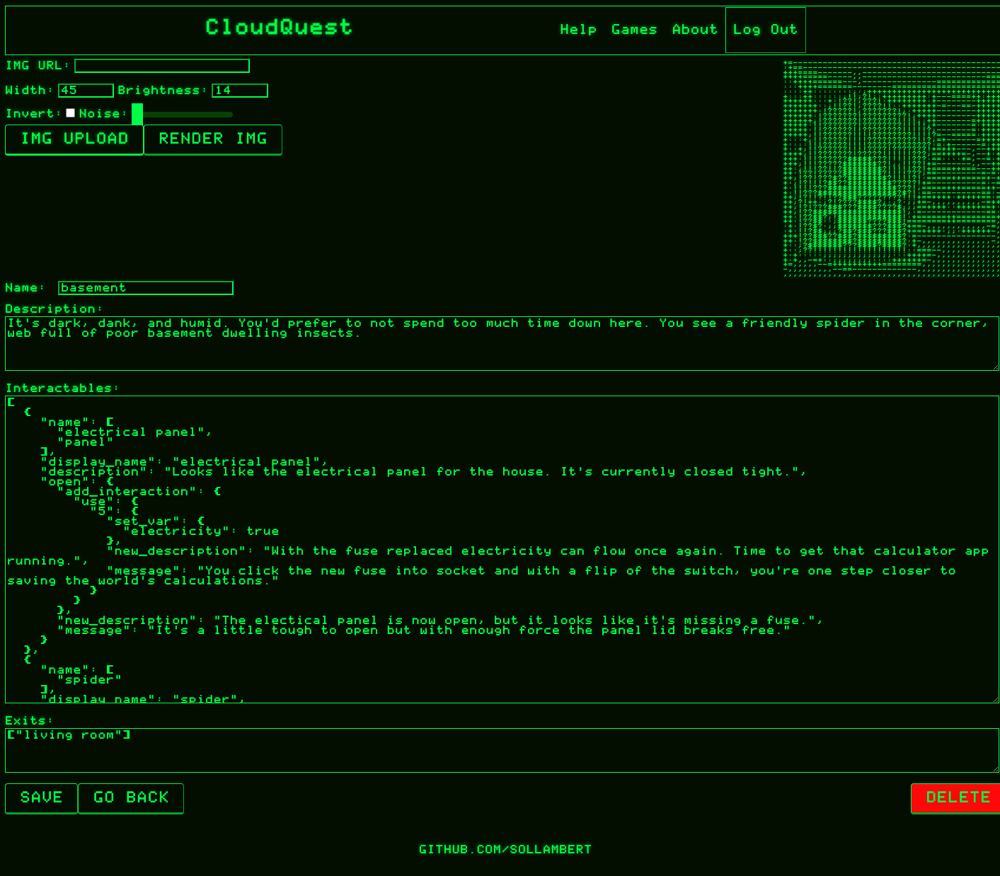

<!-- Improved compatibility of back to top link: See: https://github.com/othneildrew/Best-README-Template/pull/73 -->
<a name="readme-top"></a>
<!--
*** Thanks for checking out the Best-README-Template. If you have a suggestion
*** that would make this better, please fork the repo and create a pull request
*** or simply open an issue with the tag "enhancement".
*** Don't forget to give the project a star!
*** Thanks again! Now go create something AMAZING! :D
-->


<!-- PROJECT SHIELDS -->
<!--
*** I'm using markdown "reference style" links for readability.
*** Reference links are enclosed in brackets [ ] instead of parentheses ( ).
*** See the bottom of this document for the declaration of the reference variables
*** for contributors-url, forks-url, etc. This is an optional, concise syntax you may use.
*** https://www.markdownguide.org/basic-syntax/#reference-style-links
-->
[![MIT License][license-shield]][license-url]
[![LinkedIn][linkedin-shield]][linkedin-url]


<!-- PROJECT LOGO -->
<br />
<div align="center">
  <a href="https://github.com/sollambert/cloud-quest">
    
  </a>

<h3 align="center">CloudQuest</h3>

  <p align="center">
    CloudQuest is a platform for developing your own text-based adventure games and sharing them with others. Feel free to play the provided game 'CloudQuest' to get a feel for the gameplay and when you're ready, go ahead and create a new game under your account and get to tinkering.
    <br />
    <a href="https://github.com/sollambert/cloud-quest"><strong>Explore the docs »</strong></a>
    <br />
    <br />
    <a href="https://github.com/sollambert/cloud-quest">Live Deployment</a>
    ·
    <a href="https://github.com/sollambert/cloud-quest/issues">Report Bug</a>
    ·
    <a href="https://github.com/sollambert/cloud-quest/issues">Request Feature</a>
  </p>
</div>


<!-- TABLE OF CONTENTS -->
<details>
  <summary>Table of Contents</summary>
  <ol>
    <li>
      <a href="#about-the-project">About The Project</a>
      <ul>
        <li><a href="#built-with">Built With</a></li>
      </ul>
    </li>
    <li>
      <a href="#getting-started">Getting Started</a>
      <ul>
        <li><a href="#prerequisites">Prerequisites</a></li>
        <li><a href="#installation">Installation</a></li>
      </ul>
    </li>
    <li><a href="#usage">Usage</a></li>
    <li><a href="#contributing">Contributing</a></li>
    <li><a href="#license">License</a></li>
    <li><a href="#contact">Contact</a></li>
    <li><a href="#acknowledgments">Acknowledgments</a></li>
  </ol>
</details>


<!-- ABOUT THE PROJECT -->
## About The Project


CloudQuest was developed as a solo capstone project to demonstrate the skills I learned through Prime Digital Academy.

<p align="right">(<a href="#readme-top">back to top</a>)</p>


### Built With

* [![Node.js][Node.js]][Node-url]
* [![Express][Express.js]][Express-url]
* [![React][React.js]][React-url]
* [![Redux][Redux]][Redux-url]
* [![Redux-Saga][Reduxsaga]][Reduxsaga-url]
* [![p5][p5.js]][p5-url]
* [![Postgres][postgres]][postgres-url]
* [![Heroku][heroku]][heroku-url]

<p align="right">(<a href="#readme-top">back to top</a>)</p>


<!-- GETTING STARTED -->
## Getting Started

This is an example of how you may give instructions on setting up your project locally.
To get a local copy up and running follow these simple example steps.

### Prerequisites

To install the dependencies, make sure you're running at least version 18 of Node.
* npm
  ```sh
  npm install npm@latest -g
  ```

### Installation

1. Clone the repo
   ```sh
   git clone https://github.com/sollambert/cloud-quest.git
   ```
2. Install NPM packages
   ```sh
   npm install
   ```
3. Enter your session secret in `.env`, this should be a randomly generated string of at least 16 characters.
   ```js
   SERVER_SESSION_SECRET = '<random string of characters>';
   ```

<p align="right">(<a href="#readme-top">back to top</a>)</p>


<!-- USAGE EXAMPLES -->
## Usage

Use this space to show useful examples of how a project can be used. Additional screenshots, code examples and demos work well in this space. You may also link to more resources.

_For more examples, please refer to the help pages on the CloudQuest website. [CloudQuest](https://cloud-quest.heroku.com)_

<p align="right">(<a href="#readme-top">back to top</a>)</p>


<!-- CONTRIBUTING -->
## Contributing

Contributions are what make the open source community such an amazing place to learn, inspire, and create. Any contributions you make are **greatly appreciated**.

If you have a suggestion that would make this better, please fork the repo and create a pull request. You can also simply open an issue with the tag "enhancement".
Don't forget to give the project a star! Thanks again!

1. Fork the Project
2. Create your Feature Branch (`git checkout -b feature/AmazingFeature`)
3. Commit your Changes (`git commit -m 'Add some AmazingFeature'`)
4. Push to the Branch (`git push origin feature/AmazingFeature`)
5. Open a Pull Request

<p align="right">(<a href="#readme-top">back to top</a>)</p>


<!-- LICENSE -->
## License

Distributed under the MIT License. See `LICENSE.txt` for more information.

<p align="right">(<a href="#readme-top">back to top</a>)</p>


<!-- CONTACT -->
## Contact

Solomon Lambert - https://github.com/sollambert

Project Link: [Deployment](https://cloudquest.heroku.com)

<p align="right">(<a href="#readme-top">back to top</a>)</p>


<!-- ACKNOWLEDGMENTS -->
## Acknowledgments

* My family who have supported my initiative to follow my passion for programming
* My friends who have helped keep me sane during the Prime full stack program
* My wonderful instructors throughout the program: Kris Szafranski, Edan Schwartz, Dane Smith, Key Clark, and Vada Karlen
* My dog Ellie who kept me company all winter while I was spending endless hours troubleshooting bugs

<p align="right">(<a href="#readme-top">back to top</a>)</p>


<!-- MARKDOWN LINKS & IMAGES -->
<!-- https://www.markdownguide.org/basic-syntax/#reference-style-links -->
[product-screenshot]: https://https://github.com/sollambert/cloud-quest/blob/main/documentation/images/cloud_quest_screenshot.png
[license-shield]: https://img.shields.io/github/license/sollambert/cloud-quest.svg?style=for-the-badge
[license-url]: https://github.com/sollambert/cloud-quest/blob/main/LICENSE.TXT
[linkedin-shield]: https://img.shields.io/badge/-LinkedIn-black.svg?style=for-the-badge&logo=linkedin&colorB=555
[linkedin-url]: https://linkedin.com/in/sollambert
[p5.js]: https://img.shields.io/badge/p5.js-30333a?style=for-the-badge&logo=p5dotjs&logoColor=F3245C
[p5-url]: https://p5js.org/
[Node.js]: https://img.shields.io/badge/Node.js-30333a?style=for-the-badge&logo=nodedotjs&logoColor=4FA34D
[Node-url]: https://nodejs.org/
[Express.js]: https://img.shields.io/badge/Express.js-30333a?style=for-the-badge&logo=express&logoColor=36CAFC
[Express-url]: https://expressjs.com/
[postgres]: https://img.shields.io/badge/Postgres-20232A?style=for-the-badge&logo=postgresql&logoColor=2C6790
[postgres-url]: https://www.postgresql.org/
[Redux]: https://img.shields.io/badge/Redux-30333a?style=for-the-badge&logo=redux&logoColor=7747BA
[Redux-url]: https://redux.js.org/
[Reduxsaga]: https://img.shields.io/badge/Redux-Sagas-30333a?style=for-the-badge&logo=reduxsaga&logoColor=82D473
[Reduxsaga-url]: https://redux-saga.js.org/
[heroku]: https://img.shields.io/badge/Heroku-20232a?style=for-the-badge&logo=heroku&logoColor=604888
[heroku-url]: https://www.heroku.com/
[React.js]: https://img.shields.io/badge/React-20232A?style=for-the-badge&logo=react&logoColor=61DAFB
[React-url]: https://reactjs.org/